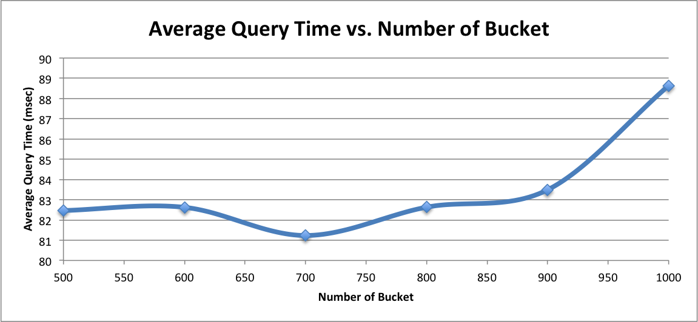

# Scrabble Suggester

This is a scrabble suggestion engine for Scrabble. For a given query, user wil be able to query (Q) for top (K) scoring scrabble words that contain the query anywhere in the word. For example, if use query for top 5 suggestion for "test", the scrabble suggester will return frequentest (score - 23), incontestably (score - 20), unquietest (score - 19), counterprotests (score - 19), and squintest (score - 18).

The scrabble score is a sum of all the letter points in a word :

| Points | Letters |
| ------ | ------- |
| 1 | A, E, I, L, N, O, R, S, T, U |
| 2 | D, G |
| 3 | B, C, M, P |
| 4 | F, H, V, W, Y |
| 5 | K |
| 8 | J, X |
| 10 | Q, Z |

The accepted list of scrabble words can be found at [word_list_moby_crossword.flat.txt](data/word_list_moby_crossword.flat.txt).

# Before Installation

Make sure you have the following before starting installation :
* Java 8
* Gradle

# How to Install and Run

* Run install.sh
* Cd into the "run" directory
* Index all scrabble words
```
./scrabble-indexer <scrabble-word-file>

e.g. ./scrabble-indexer ../data/word_list_moby_crossword.flat.txt
```
* Query with scrabble suggester
```
./scrabble-suggester <query> <top-k>

e.g. ./scrabble-suggester test 5
```

# How It Works

In a brute force method, we scan through all scrabble words and find all matches for a query. Then, we score all matches accordingly and return the top-k matches as suggestions. However, this is not efficient as it involves scanning through all scrabble words and inspecting each word to check if it is a match.

A scrabble word could be a match of various queries. For example, a scrabble word "foobar" could be a match for query 'f', 'ba', 'oba', 'foob', 'fooba', 'foobar', etc. To improve the suggestion computation time, we pre-compute a set of queries that could be a match for a scrabble word. The set of queries that we pre-compute are called n-grams. For more information about n-grams, please refer to : http://en.wikipedia.org/wiki/N-gram.

For example, n-grams for "foobar" are :

| n | n-grams |
| --- | ------- |
| uni-gram | 'f', 'o', 'b', 'a', 'r' |
| bi-gram | 'fo', 'oo', 'ob', 'ba', 'ar' |
| tri-gram | 'foo', 'oob', 'oba' 'bar' |
| 4-gram | 'foob', 'ooba', 'obar' |
| 5-gram | 'fooba' ,'oobar' |
| 6-gram | 'foobar' |

In the indexing phrase, we scan through all scrabble words and pre-compute their n-grams. We store a mapping of n-gram to list of matched scrabble words as index. With the pre-computed n-grams for all scrabble words, we can quick find the matching scrabble words.

However, we will have a large index if we pre-comptue all n-grams up to the length of each scrabble words. Instead, we index n-grams up to max-n and perform some check during query time. 

For example, the following happens if max-n is 3 and query is 'foob' :
* Compute max-n-gram for the query : 'foo' and 'oob'
* Retrieve list of matched scrabble words for both 'foo' and 'oob'
* Check each of scrabble words to make sure that it contains 'foob'
* Rank all valid matches and return top-k matches as suggestions

Also, we would want to split the index file into a number of buckets so that we will not need to load all index during query time. The bucket which a n-gram will go to is based on the hash value of the n-gram modulo by the number of bucket.

## How To Pick Max-N

The first plot below shows the coverage percentage versus n-gram. The second plot below shows the index size versus n-gram. You can find the raw data at [nGramWordCount_plot.xls](analysis/nGramWordCount_plot.xls). We can see that index size grows as we have more n-grams. We want to find a balance between coverage percentage and index size. Here, I choose max-n to be 4 as it has coverage of about 65% and will generate index with size 50% of the possible maximum index size. 


![indexSizeVsNGram] (analysis/indexSizeVsNGram.png)


## How To Pick Number of Bucket

We compile a list of test queries which will be used for testing with different number of bucket. These are the original sources where I randomly pick p number of test queries from :
* 5-gram to 21-gram of all scrabble words (I do not genereate n-gram with n less than 5 since I have picked max-n to be 4. This implies that any queries with length 4 or less will have a exact match from the index) (number of queries - 109k)
* Randomly generated queries of length 5 to 21 (number of queries - 100k)

I ran 5 iteration with the following setting:
* Different set of 500 test queries
* Top 100 suggestions for each test query
* With bucket size : 500, 600, 700, 800, 900, 1000
 
This plot shows the result from the run:



Hence, I have chosen number of bucket to be 700.

# Project Structure

The top level project is called scrabble. I have 4 sub-module within the scrabble project :
* scrabble-common : contains classes which are common to all sub-modules
* scrabble-indexer : contains the indexer logic
* scrabble-suggester : contains the suggester logic
* scrabble-analysis : contains codes that i used for doing analysis
